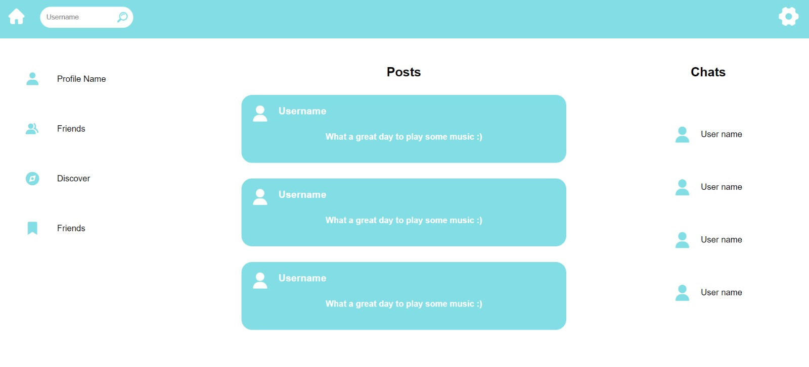
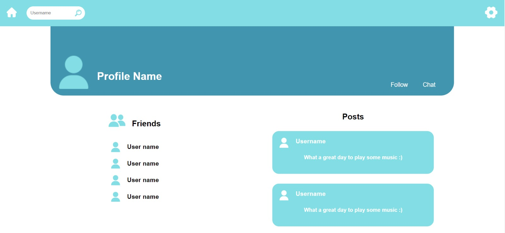

# Informe trabajo parcial

## Descripción y Fundamentación del Problema

Según Freire & Ocaña (2021), la sobrecarga de algoritmos en las redes sociales, especialmente en las funciones de seguimiento, búsqueda y agregación, plantea un problema sustancial al inundar a los usuarios con recomendaciones y contenido poco relevantes, notificaciones intrusivas y una experiencia general de usuario abrumadora. Esta deficiencia algorítmica impacta negativamente la navegación, la privacidad y la satisfacción de los usuarios, subrayando la necesidad de desarrollar algoritmos más precisos y equilibrados que personalicen la experiencia de manera efectiva mientras se abordan las preocupaciones éticas y de privacidad para mejorar la calidad de las redes sociales en línea. Además, esta sobrecarga algorítmica también puede tener implicaciones más amplias en la sociedad, ya que influye en la forma en que las personas interactúan, consumen información y toman decisiones en un mundo cada vez más digitalizado. La calidad de los algoritmos en las redes sociales no solo afecta la satisfacción individual del usuario, sino que también puede influir en la polarización política, la difusión de información errónea y la formación de burbujas de filtro, lo que subraya aún más la importancia de abordar este problema de manera efectiva para mantener una comunidad en línea saludable y equilibrada.

## Descripción y Visualización de Datos

### Descripción de los datos

Para la realización de este proyecto, se ha desarrollado una base de datos que consta de dos tablas: `users` y `user_followers`.

En la tabla `users`, se almacenan los detalles de los usuarios, que en el contexto de nuestro proyecto, representan los nodos del grafo con el cuál trabajaremos.

Estos datos incluyen aquella información selecciondada para satisfacer las necesidades de nuestra red social. Los campos incluyen:

- `username`: Nombre de usuario
- `email`: Correo electrónico
- `password`: Contraseña
- `first_name`: Nombre
- `last_name`: Apellido
- `date_of_birth`: Fecha de nacimiento
- `country`: País de residencia
- `phone_number`: Número de teléfono
- `joined_date`: Fecha de registro

Por otro lado, la tabla `user_followers` almacena las relaciones entre los usuarios, es decir, a quiénes siguen los usuarios. En el contexto del proyecto, esta tabla almacena las aristas o conexiones entre los nodos.

### Origen de los datos
Para generar estos datos, se han implementado dos scripts en Python que se encuentran en los archivos [user_generation.py](https://github.com/202210494/complejidad-algoritmica-grupo-05/blob/main/Base%20de%20datos/user_generation.py) y [followers_generation.py](https://github.com/202210494/complejidad-algoritmica-grupo-05/blob/main/Base%20de%20datos/followers_generation.py).

`user_generation.py`

> Este archivo emplea la biblioteca [Faker](https://github.com/joke2k/faker) para generar datos ficticios de **1500** posibles usuarios y los incorpora en la base de datos.

`followers_generation.py`

> Este archivo procesa cada usuario en la tabla `users`, utilizando la biblioteca `random` de Python para determinar aleatoriamente a cuántos usuarios seguirá el usuario en cuestión, y luego añade esas relaciones a la base de datos en la tabla correspondiente.
>
> Es importante destacar que resulta complicado determinar la cantidad exacta de aristas que contendrá nuestro conjunto de datos debido a su naturaleza aleatoria. Sin embargo, se estima que habrá aproximadamente alrededor de **37500** aristas o, en el contexto de nuestro proyecto, conexiones entre usuarios.

### Visualización de los datos

Para llevar a cabo la visualización de los datos, se ha desarrollado el script [visualizacion_datos.py](../Base%20de%20datos/visualizacion_datos.py), el cual hace uso de la biblioteca [pyvis](https://github.com/WestHealth/pyvis). 
Esta biblioteca nos ha proporcionado las herramientas necesarias para generar una visualización del grafo con el que trabajaremos.

Para realizar esta visualización no se emplearon todos los datos disponibles, sino simplemente una muestra representativa que consta de `200` nodos y `1604` aristas. 
La razón detrás de esta decisión radica en la imposibilidad de visualizar la totalidad de los datos debido a su volumen.

A continuación, se muestra la representación gráfica del grafo generado a partir de esta muestra. 
En este contexto, cada nodo representa a un usuario, y cada arista simboliza una conexión del tipo "sigue a":

## Nuestra propuesta

### Objetivos

Nosotros hemos propuesto nuestros objetivos en base a la metodología de objetivos smart:

Nuestro objetivo principal es crear una red social con funcionalidades básicas (creación de un perfil, seguir perfiles y buscar perfiles) durante las
siguientes 8 semanas con sprints intermedios. Nuestro proyecto debe implementarse en base a algoritmos eficientes capaces de soportar grandes cantidades de datos.

### Tecnica y Metodología

La metodología utilizada en este proyecto se basa en la metodología ágil. Hemos dividido el proyecto en sprints, lo cuales nos permiten una mejor organización en cuestión a los objetivos.

Las partes que componen cada sprint son:

> Objetivos de sprints (Inicio) 
> Seguimiento diario (Desarrollo) 
> Revision de cumplimiento (Cierre)

## Diseño del aplicativo

### Proceso de diseño
El diseño de la aplicación se centra en abordar la problemática identificada de la sobrecarga algorítmica en las redes sociales, como señalan Freire & Ocaña (2021). 
Esto se logrará mediante la implementación de un algoritmo de recomendación basado en contactos en común, procurando que las sugerencias se limiten a usuarios relevantes. 

Se seguirá una metodología de desarrollo ágil, con iteraciones regulares para adaptarse a los cambios y retroalimentación continua. 

Para el diseño, las etapas incluirán la planificación inicial, el diseño conceptual, la implementación y pruebas continuas hasta la fase de publicación.

### Ingeniería de Software

La aplicación se desarrollará con un enfoque clave en la modularidad, esto con el objetivo de que todas las partes de la aplicación interactúen de manera eficiente. Asegurando mantener una fácil mantenibilidad y escalabilidad.

### Análisis de Algoritmos

Dado que la aplicación implica el uso de algorítmos para recomendar usuarios a los que seguir, se ha decidido priorizar la precisión y relevancia de estas recomendaciones.

### Interfaz de usuario

Dado que el algoritmo a desarrollar se implementará sobre una red social, se ha priorizado el desarrollo de una interfaz de usuario que ofrezca una experiencia amigable e intuitiva. 

La interfaz permitirá a los usuarios crear perfiles, seguir a otros usuarios y realizar búsquedas de perfiles de manera sencilla.

**Pagina de registro**:

**Pagina principal**:

**Pagina perfil**:

## Fuentes
Freire, T., & Ocaña, P. (2021). Impacto de la gestión de redes sociales en las empresas gastrononómicas.
https://preprints.scielo.org/index.php/scielo/preprint/download/2556/4414/4583

